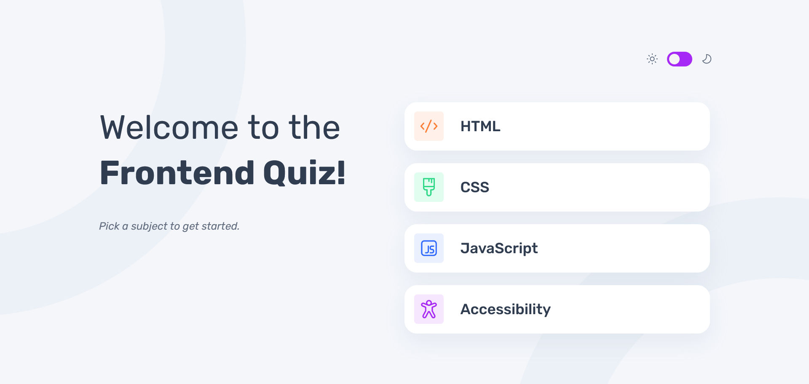

# Frontend Mentor - Frontend quiz app



## The challenge

Your users should be able to:

- :white_check_mark: Select a quiz subject [Check solution here](#quiz-subject):point_left:
- :white_check_mark: Select a single answer from each question from a choice of four [Check solution here](#single-answer):point_left:
- :white_check_mark: See an error message when trying to submit an answer without making a selection
- :white_check_mark: See if they have made a correct or incorrect choice when they submit an answer
- :white_check_mark: Move on to the next question after seeing the question result
- :white_check_mark: See a completed state with the score after the final question
- :white_check_mark: Play again to choose another subject
- :white_check_mark: View the optimal layout for the interface depending on their device's screen size
- :white_check_mark: See hover and focus states for all interactive elements on the page
- :white_check_mark: Navigate the entire app only using their keyboard [Check solution here](#keyboard-accessibility):point_left:
- :white_check_mark: **Bonus**: Change the app's theme between light and dark

# Frontend Mentor - Frontend quiz app solution

This is a solution to the [Frontend quiz app challenge on Frontend Mentor](https://www.frontendmentor.io/challenges/frontend-quiz-app-BE7xkzXQnU). Frontend Mentor challenges help you improve your coding skills by building realistic projects.

## Table of contents

- [Overview](#overview)
  - [Screenshot](#screenshot)
  - [Links](#links)
- [My process](#my-process)
  - [Built with](#built-with)
  - [What I learned](#what-i-learned)
  - [Useful resources](#useful-resources)
- [Author](#author)

### Screenshot


 

### Links

- Solution URL: [Solution source files](https://github.com/marcfranciss/Frontend-quiz-app/tree/main/src)
- Live Site URL: [Add live site URL here](https://marcfranciss.github.io/Frontend-quiz-app/)
- [Lighhouse](https://pagespeed.web.dev/analysis/https-marcfranciss-github-io-Frontend-quiz-app/ozooyhmfgb?form_factor=mobile) - Lighthouse result

## My process

### Built with

- Semantic HTML5 markup
- CSS Preprocessor (SaSS)
- Flexbox
- [React](https://reactjs.org/) - JS library
- [SaSS](https://sass-lang.com/) - For styles
- [Typescript](https://www.typescriptlang.org/) - For cleaner JS

### What I learned

I leared a lot about React's ThemeContext and ThemeProvider. How to use it in dynamically changing themes. Also, scss' mixins and function help greatly in the theme's building process.

### Useful resources

- [Katie McTigue's Dark Mode in Sass](https://medium.com/@katiemctigue/how-to-create-a-dark-mode-in-sass-609f131a3995) - This is an amazing article which helped me finally understand mixins and how to implement it throughout the project. I'd recommend it to anyone still learning this concept.
- [David Xu's 'Light mode/Dark mode: Dynamic theming through SCSS mixin'](https://david-x.medium.com/light-mode-dark-mode-dynamic-theming-through-scss-mixin-c86e57a4de49) - This is also an amazing article which helped me minify the usage of mixins and functions for dark/light theme. Check this out as well if you're trying to learn themes using sass.

## Author

- Website - [MackersDev](https://mackersdev.net)
- Frontend Mentor - [@marcfranciss](https://www.frontendmentor.io/profile/marcfranciss)

## Quiz subject

- Selecting quiz subject requires that the landing page is visible or the quiz is refreshed/resets.
- Setting conditional statement to check if the client has selected a subject in **<main>** and display the quiz in <section>

```js
const [subjectSelected, setSubjectSelected] = useState(true);

{subjectSelected ? (<main>...</main>) : (<section>...</section>)}
```

## Single answer

:memo: The idea here is to select only one from the four given choices and, in my opinion, using *input[type=radio]* with the same **name** is the best approach for this.

```html
<input type='radio' name='option' id='optionA'/> A
<input type='radio' name='option' id='optionB'/> B
<input type='radio' name='option' id='optionC'/> C
<input type='radio' name='option' id='optionC'/> D
```

## Keyboard accessibility

To have the options on radio button easily accessible with key board, the 'autoFocus' attribute is added.

```html
<input type='radio' autoFocus />
```

Then, for the first radio button to be focussed, a simple code is added '**autoFocus={i===0}**', where '**i**' is index and '**0**' is the first item in the index.

```html
<input type='radio' autoFocus={i === 0} />
```
